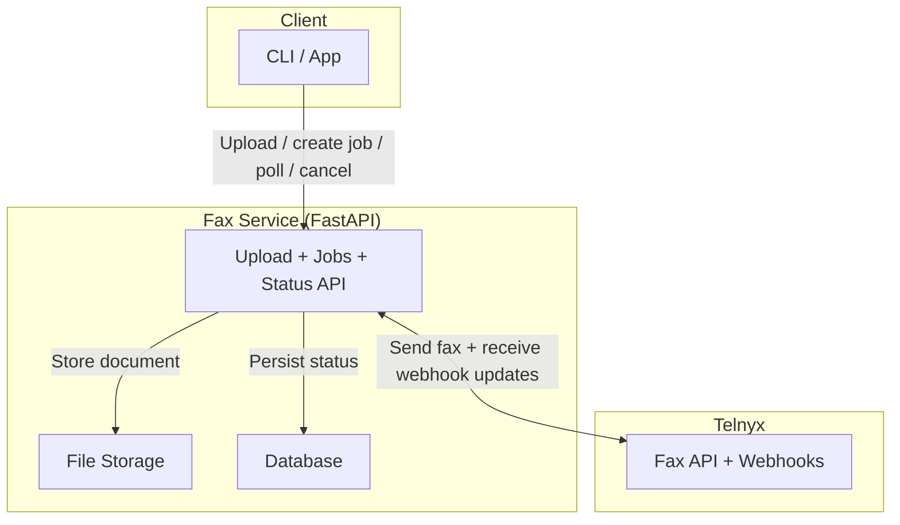

# Telnyx Fax OSS Example

A minimal FastAPI project that demonstrates outbound fax sending with [Telnyx Programmable Fax](https://developers.telnyx.com/docs/programmable-fax/get-started).

This repository is API-only (no product UI) and is intended as a runnable reference implementation.

## What This Project Does
- Accepts a PDF/JPG/PNG upload
- Creates an outbound fax job
- Sends the fax through Telnyx
- Tracks lifecycle events from Telnyx webhooks
- Exposes status and cancel endpoints

## API Endpoints
- `GET /v1/health`
- `POST /v1/uploads`
- `GET /v1/uploads/public/{storage_key}`
- `POST /v1/fax/jobs`
- `GET /v1/fax/jobs/{fax_job_id}`
- `POST /v1/fax/jobs/{fax_job_id}/cancel`
- `POST /v1/webhooks/telnyx`

## Architecture Flow


## Quick Start (Local Mock Mode)
Use this path first to confirm the app boots correctly.

1. Create env file and install dependencies.
```bash
cd <repo-path>
cp .env.example .env
uv sync --extra dev
```
2. Create database schema.
```bash
uv run alembic upgrade head
```
3. Start API.
```bash
make run HOST=0.0.0.0 PORT=8000
```
4. Confirm health.
```bash
curl -s http://localhost:8000/v1/health | jq
```

## First Live Fax (Simple 6-Step Path)
1. In `.env`, set live values:
```bash
TELNYX_FAX_MOCK_PROVIDERS=false
TELNYX_FAX_BASE_URL=https://<public-host>
TELNYX_FAX_TELNYX_API_KEY=<telnyx-api-key>
TELNYX_FAX_TELNYX_CONNECTION_ID=<fax-api-application-id>
TELNYX_FAX_TELNYX_FROM_NUMBER=+1XXXXXXXXXX
```
2. Start the API (`make run HOST=0.0.0.0 PORT=8000`).
3. If running locally, open a stable public tunnel:
```bash
cloudflared tunnel --url http://localhost:8000
```
4. Set Telnyx webhook URL to:
```text
https://<public-host>/v1/webhooks/telnyx
```
5. Run the commands in `docs/API_FLOW_EXAMPLE.md`.
6. Check status with `GET /v1/fax/jobs/{fax_job_id}` until it is `delivered` or `failed`.

## Development Checks
```bash
make lint
make test
```

## Documentation
- `docs/IMPLEMENTATION_STEPS.md`
- `docs/TELNYX_SERVICES_USED.md`
- `docs/LIVE_RUNBOOK.md`
- `docs/API_FLOW_EXAMPLE.md`

## Security
- Do not commit `.env`.
- Rotate API keys if exposed.
- Enable webhook signature verification outside local testing.

## License
MIT. See `LICENSE`.
